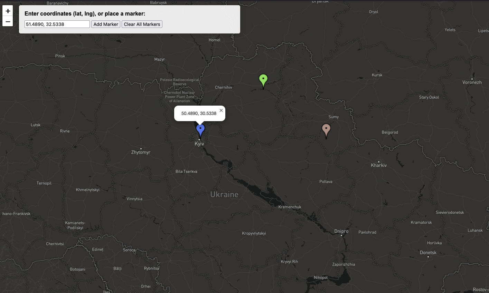

# lat-long-generator
Generates lat/long coordinates when a user places a marker. 

A quick and dirty map that that users can place multiple, random markers and get lat/long coordinates in the pop-up, and enter the coordinates directly into the box. 

A right click removes the pop-up, or you can remove all pop-ups with the button.

Built as a supplement for another mapping project, wherein muliple layers share coordinates. The markers then stack and can't be accessed by users. Using this tool one can space out the common coordinates to allow access to all the markers.

Uses the google charts api to generate random colors for the markers.

For use with mapbox tiles, or OSM tiles . . . 
 

